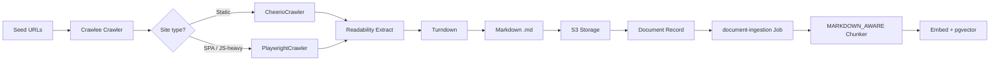

## Overview

The current web crawler (`BreadthFirstCrawler`) uses raw `fetch()` and regex-based HTML extraction. This approach loses document structure, cannot render JavaScript SPAs, and lacks enterprise resilience features like automatic retries, proxy rotation, and session management.

This document describes the rewrite to an enterprise-grade crawling stack built on **Crawlee**, **Mozilla Readability**, and **Turndown**. The new pipeline produces clean Markdown from crawled pages, unlocking the existing `MARKDOWN_AWARE` chunker to split content semantically by headings — resulting in significantly better embedding quality.

## Why This Stack?

| Layer | Technology | Role |
|-------|------------|------|
| **Crawler** | [Crawlee](https://crawlee.dev) | TypeScript-native web scraping framework. Provides request queues, auto-scaling, retries, proxy rotation, session pools, and bot-protection evasion. |
| **Renderer** | Playwright (via Crawlee) | Headless browser for JavaScript-heavy SPAs. CheerioCrawler is used as a fast fallback for static sites. |
| **Extractor** | [@mozilla/readability](https://github.com/mozilla/readability) | Firefox Reader Mode algorithm. Removes nav, ads, sidebars, footers — keeps the article/main content. |
| **Converter** | [Turndown](https://github.com/mixmark-io/turndown) | Converts semantic HTML into Markdown preserving headings, lists, tables, links, and code blocks. |

### Comparison: Old vs New

| Capability | Before | After |
|------------|--------|-------|
| JS execution | ❌ Raw `fetch()` | ✅ Playwright headless |
| Content extraction | Regex tag stripping | Mozilla Readability (semantic) |
| Output format | Flat text (`stripHtml`) | Structured Markdown |
| Retry logic | Manual redirect hops (max 5) | Automatic with exponential backoff |
| Concurrency | Sequential (500ms delay) | Configurable parallel requests |
| Session/cookies | None | Session pool with cookie jars |
| Proxy rotation | None | Built-in proxy config |
| Same-domain enforcement | Custom regex | Crawlee `enqueueLinks` strategy |
| Bot protection | Static UA (`ChatbotKB/1.0`) | TLS fingerprint + human-like headers |
| Chunking compatibility | Only `FIXED_SIZE` / `RECURSIVE_CHARACTER` work well | `MARKDOWN_AWARE` unlocks semantic chunks |

## New Architecture



## Implementation Plan

### Phase 1: Dependencies

Add the following packages to the workspace root:

```bash
bun add crawlee turndown @mozilla/readability jsdom
bun add -d @types/turndown @types/jsdom
```

> **Note:** `crawlee` has `playwright` as an optional peer dependency. If not already present, add it: `bun add -d playwright` (or `playwright-core`). Bun's package resolution handles peer deps gracefully.

**Update `libs/knowledge-base/src/env.ts`** to add optional Crawlee configuration:

```typescript
const kbEnvSchema = z.object({
  AWS_REGION: z.string().default('ap-south-1'),
  OPENAI_API_KEY: z.string().optional(),
  COHERE_API_KEY: z.string().optional(),
  OLLAMA_BASE_URL: z.string().optional(),
  // New: optional proxy for crawls
  CRAWL_PROXY_URL: z.string().url().optional(),
});
```

### Phase 2: Delete Legacy Crawler Files

Remove these files entirely:

- `libs/knowledge-base/src/web-crawler/fetcher.ts`
- `libs/knowledge-base/src/web-crawler/extractor.ts`
- `libs/knowledge-base/src/web-crawler/url-filter.ts`

> The URL filtering logic is replaced by Crawlee's built-in `enqueueLinks` with `globs`, `exclude`, and `strategy` options.

### Phase 3: New Web Crawler Module

Create the following files in `libs/knowledge-base/src/web-crawler/`:

#### `types.ts` (update existing)

```typescript
export interface CrawlOptions {
  seedUrls: string[];
  crawlDepth: number; // 0-3
  includePatterns?: string[];
  excludePatterns?: string[];
  maxPages?: number; // default 50
  /** Use headless browser for JS-heavy sites */
  useHeadless?: boolean;
}

export interface CrawledPage {
  url: string;
  title: string;
  /** Clean Markdown extracted from the page */
  markdown: string;
  /** Plain text length estimate */
  textLength: number;
  fetchedAt: Date;
}

export interface WebCrawler {
  crawl(options: CrawlOptions): Promise<CrawledPage[]>;
}
```

#### `extraction.ts` (new)

Responsible for Readability → Turndown conversion.

```typescript
import { JSDOM } from 'jsdom';
import { Readability } from '@mozilla/readability';
import TurndownService from 'turndown';
import { createLogger } from '@chatbot/shared/workers';

const extractLogger = createLogger('kb:web-crawler:extraction');

export interface ExtractionResult {
  title: string;
  markdown: string;
  textLength: number;
}

const turndown = new TurndownService({
  headingStyle: 'atx',
  bulletListMarker: '-',
  codeBlockStyle: 'fenced',
});

// Remove navigation, ads, and decorative elements before Readability sees them
const PRE_STRIP_SELECTORS = [
  'nav', 'header', 'footer', 'aside', '.sidebar', '.advertisement',
  'script', 'style', 'noscript', 'iframe', 'form',
];

export function extractMarkdownFromHtml(html: string, url: string): ExtractionResult {
  try {
    const dom = new JSDOM(html, { url });
    const doc = dom.window.document;

    // Pre-strip noisy elements
    for (const selector of PRE_STRIP_SELECTORS) {
      for (const el of Array.from(doc.querySelectorAll(selector))) {
        el.remove();
      }
    }

    const reader = new Readability(doc, { debug: false });
    const article = reader.parse();

    if (!article) {
      extractLogger.warn({ url }, 'Readability could not extract article; falling back to body content');
      // Fallback: convert the cleaned body HTML to markdown
      const body = doc.body;
      if (!body) {
        return { title: '', markdown: '', textLength: 0 };
      }
      const markdown = turndown.turndown(body.innerHTML);
      return { title: doc.title ?? '', markdown, textLength: markdown.length };
    }

    const markdown = turndown.turndown(article.content);
    extractLogger.debug({ url, title: article.title, markdownLength: markdown.length }, 'Extracted markdown');

    return {
      title: article.title ?? '',
      markdown,
      textLength: markdown.length,
    };
  } catch (err) {
    const error = err instanceof Error ? err : new Error(String(err));
    extractLogger.error({ url, errorMessage: error.message, errorStack: error.stack }, 'Extraction failed');
    throw error;
  }
}
```

#### `crawlee-engine.ts` (new)

Wraps Crawlee's `CheerioCrawler` and `PlaywrightCrawler` with unified configuration.

```typescript
import { CheerioCrawler, PlaywrightCrawler, RequestQueue, Configuration } from 'crawlee';
import { JSDOM } from 'jsdom';
import { Readability } from '@mozilla/readability';
import TurndownService from 'turndown';
import { createLogger } from '@chatbot/shared/workers';
import type { CrawlOptions, CrawledPage } from './types';

const engineLogger = createLogger('kb:web-crawler:engine');

// Configure Crawlee to use a temporary in-memory storage directory
// so the worker does not accumulate on-disk queues between restarts.
Configuration.set('storageClientOptions', { storageDir: process.env.CRAWLEE_STORAGE_DIR ?? '/tmp/crawlee-storage' });

export async function runCrawleeCrawl(options: CrawlOptions): Promise<CrawledPage[]> {
  const {
    seedUrls,
    crawlDepth,
    includePatterns,
    excludePatterns,
    maxPages = 50,
    useHeadless = false,
  } = options;

  engineLogger.info({ seedUrls, crawlDepth, maxPages, useHeadless }, 'Starting Crawlee crawl');

  const results: CrawledPage[] = [];
  const requestQueue = await RequestQueue.open(`kb-crawl-${Date.now()}`);

  // Seed initial requests
  for (const url of seedUrls) {
    await requestQueue.addRequest({ url, label: 'page', userData: { depth: 0 } });
  }

  const sharedConfig = {
    requestQueue,
    maxRequestsPerCrawl: maxPages,
    maxRequestRetries: 3,
    requestHandlerTimeoutSecs: 60,
    respectRobotsTxtFile: true,
    keepAlive: false,
  };

  const turndown = new TurndownService({
    headingStyle: 'atx',
    bulletListMarker: '-',
    codeBlockStyle: 'fenced',
  });

  const handlePage = async (url: string, html: string, depth: number): Promise<void> => {
    try {
      const dom = new JSDOM(html, { url });
      const doc = dom.window.document;

      // Pre-strip noisy elements
      const stripSelectors = ['nav', 'header', 'footer', 'aside', 'script', 'style', 'noscript', 'iframe'];
      for (const sel of stripSelectors) {
        for (const el of Array.from(doc.querySelectorAll(sel))) el.remove();
      }

      const reader = new Readability(doc, { debug: false });
      const article = reader.parse();

      let markdown: string;
      let title: string;

      if (article) {
        markdown = turndown.turndown(article.content);
        title = article.title ?? doc.title ?? '';
      } else {
        markdown = doc.body ? turndown.turndown(doc.body.innerHTML) : '';
        title = doc.title ?? '';
      }

      if (markdown.trim().length === 0) {
        engineLogger.warn({ url }, 'Empty markdown after extraction; skipping page');
        return;
      }

      results.push({
        url,
        title,
        markdown,
        textLength: markdown.length,
        fetchedAt: new Date(),
      });

      engineLogger.debug({ url, title, depth, markdownLength: markdown.length }, 'Page extracted');
    } catch (err) {
      const error = err instanceof Error ? err : new Error(String(err));
      engineLogger.error({ url, errorMessage: error.message }, 'Page extraction failed');
    }
  };

  const enqueueLinksConfig = {
    globs: includePatterns?.length ? includePatterns : undefined,
    exclude: excludePatterns?.length ? excludePatterns : undefined,
    strategy: 'same-domain' as const,
    transformRequestFunction(req) {
      const userData = (req as any).userData ?? {};
      const parentDepth = userData.depth ?? 0;
      if (parentDepth + 1 > crawlDepth) {
        return false; // Do not enqueue beyond max depth
      }
      (req as any).userData = { ...userData, depth: parentDepth + 1 };
      return req;
    },
  };

  if (useHeadless) {
    const crawler = new PlaywrightCrawler({
      ...sharedConfig,
      headless: true,
      browserPoolOptions: { fingerprintOptions: { fingerprintInjectorOptions: { escapePlugins: true } } },
      async requestHandler({ page, request, enqueueLinks }) {
        await page.waitForLoadState('networkidle');
        const html = await page.content();
        const depth = request.userData?.depth ?? 0;
        await handlePage(request.url, html, depth);
        if (depth < crawlDepth) {
          await enqueueLinks(enqueueLinksConfig);
        }
      },
    });
    await crawler.run();
  } else {
    const crawler = new CheerioCrawler({
      ...sharedConfig,
      async requestHandler({ $, request, enqueueLinks }) {
        const html = $.html();
        const depth = request.userData?.depth ?? 0;
        await handlePage(request.url, html, depth);
        if (depth < crawlDepth) {
          await enqueueLinks(enqueueLinksConfig);
        }
      },
    });
    await crawler.run();
  }

  engineLogger.info({ crawledCount: results.length }, 'Crawl complete');
  return results;
}
```

#### `index.ts` (rewrite)

```typescript
import { createLogger } from '@chatbot/shared/workers';
import type { CrawlOptions, CrawledPage, WebCrawler } from './types';
import { runCrawleeCrawl } from './crawlee-engine';

const crawlLogger = createLogger('kb:web-crawler');

export class CrawleeWebCrawler implements WebCrawler {
  async crawl(options: CrawlOptions): Promise<CrawledPage[]> {
    crawlLogger.info({ seedUrls: options.seedUrls, crawlDepth: options.crawlDepth }, 'CrawleeWebCrawler.start');
    const results = await runCrawleeCrawl(options);
    crawlLogger.info({ count: results.length }, 'CrawleeWebCrawler.complete');
    return results;
  }
}

export interface CrawlerFactoryOptions {
  delayMs?: number; // Ignored in Crawlee (replaced by concurrency controls)
  useHeadless?: boolean;
}

export function createWebCrawler(options: CrawlerFactoryOptions = {}): WebCrawler {
  return new CrawleeWebCrawler();
}

export * from './types';
```

### Phase 4: Update Worker Handler

**File:** `apps/workers/src/jobs/web-crawl/handler.ts`

Changes:
1. The crawler now returns `CrawledPage` with a `markdown` field instead of `text`.
2. Upload content as `text/markdown` (not `text/plain`).
3. Store the page title in metadata.

```typescript
// Inside handleWebCrawl, inside the pages loop:
const fileName = `${page.url.replace(/[^a-zA-Z0-9]/g, '_')}.md`;
const mimeType = 'text/markdown'; // <-- changed from text/plain
const mdBuffer = Buffer.from(page.markdown, 'utf-8');

// ... upload to S3 ...

const document = await docRepo.create({
  dataSourceId,
  sourceKey: s3Key,
  fileName,
  mimeType,
  sizeBytes: mdBuffer.length,
  metadata: {
    url: page.url,
    title: page.title,
    textLength: page.textLength,
    fetchedAt: page.fetchedAt.toISOString(),
  },
});
```

> **Backward compatibility:** Existing `text/plain` documents already in S3 continue to work; the ingestion pipeline handles them via the existing `TextParser`.

### Phase 5: Adapt Document Ingestion Pipeline

**Problem:** The current `MarkdownParser` strips Markdown syntax (removes `#`, `*`, etc.) to produce plain text. This destroys heading structure that the `MARKDOWN_AWARE` chunker needs.

**Solution:** For `text/markdown` documents, preserve the raw Markdown and pass it directly to chunking.

**File:** `apps/workers/src/jobs/document-ingestion/handler.ts`

Update the parse step:

```typescript
// 3. Parse document
let rawText: string;
if (mimeType === 'text/markdown' || mimeType === 'text/x-markdown') {
  // Preserve markdown structure for MARKDOWN_AWARE chunking
  rawText = buffer.toString('utf-8');
  log.info({ documentId, mimeType }, 'Preserved raw markdown (skipping strip parser)');
} else {
  const parser = getDocumentParser(mimeType);
  rawText = await parser.parse(buffer, mimeType);
}
log.info({ documentId, mimeType, rawTextLength: rawText.length }, 'Document parsed successfully');
```

**File:** `libs/knowledge-base/src/parsers/index.ts`

Update `stripMarkdown` docstring to clarify that `MarkdownParser` is for cases where plain text is explicitly desired. For crawled content, we now bypass it.

```typescript
/**
 * Markdown parser — returns raw markdown text as-is.
 * Previously stripped markdown syntax; now preserved so MARKDOWN_AWARE
 * chunking can split by headings. Callers that need plain text can apply
 * stripMarkdown() explicitly after parsing.
 */
export class MarkdownParser implements DocumentParser {
  async parse(buffer: Buffer, _mimeType: string): Promise<string> {
    return buffer.toString('utf-8');
  }
}
```

> **Note:** If any existing upload flows rely on `MarkdownParser` stripping syntax, this is a breaking change. In practice, uploaded Markdown files are rare and preserving structure is the correct default. The old `stripMarkdown` function remains exported for explicit use.

### Phase 6: Update Tests

**File:** `libs/knowledge-base/src/web-crawler/index.test.ts`

Replace the existing tests with tests for:

1. **Extraction pipeline** — JSDOM + Readability + Turndown round-trip
2. **Crawlee engine** — mocked request queue and request handler
3. **URL filtering** — globs, exclude, same-domain strategy
4. **Depth limiting** — verified by `userData.depth` / `transformRequestFunction`
5. **Empty page handling** — pages with no content are skipped gracefully

Example test structure:

```typescript
import { describe, it, expect, vi } from 'vitest';
import { extractMarkdownFromHtml } from './extraction';

describe('extractMarkdownFromHtml', () => {
  it('converts article HTML to markdown', () => {
    const html = `
      <html><head><title>Guide</title></head>
      <body>
        <nav>Menu</nav>
        <article>
          <h1>Hello</h1>
          <p>World</p>
          <ul><li>A</li><li>B</li></ul>
        </article>
      </body>
    </html>`;
    const result = extractMarkdownFromHtml(html, 'https://example.com/guide');
    expect(result.markdown).toContain('# Hello');
    expect(result.markdown).toContain('- A');
    expect(result.markdown).not.toContain('<nav>');
    expect(result.title).toBe('Guide');
  });

  it('falls back to body when Readability fails', () => {
    const html = '<html><body><p>Only body</p></body></html>';
    const result = extractMarkdownFromHtml(html, 'https://example.com');
    expect(result.markdown).toContain('Only body');
  });

  it('returns empty for completely empty pages', () => {
    const result = extractMarkdownFromHtml('<html></html>', 'https://example.com');
    expect(result.markdown).toBe('');
  });
});
```

**File:** `apps/workers/src/jobs/web-crawl/handler.test.ts` (new)

Test that the handler:
- Creates documents with `mimeType: 'text/markdown'`
- Uploads `.md` files to S3
- Enqueues ingestion jobs correctly

**File:** `apps/workers/src/jobs/document-ingestion/handler.test.ts` (new or update existing)

Test that `text/markdown` documents:
- Bypass the `MarkdownParser` strip logic
- Are chunked with `MARKDOWN_AWARE` strategy correctly

### Phase 7: Data Source Config UI

**File:** `apps/web-ui/app/api/knowledge-bases/[id]/sources/route.ts` (or relevant frontend form)

Add an optional `useHeadless` boolean to the data source config. When checked, the worker uses `PlaywrightCrawler`; otherwise it defaults to the faster `CheerioCrawler`.

```typescript
// DataSource config JSON shape
interface UrlDataSourceConfig {
  urls: string[];
  crawlDepth: number;
  includePatterns?: string[];
  excludePatterns?: string[];
  useHeadless?: boolean; // NEW
}
```

No schema migration is required — the `config` column is JSON.

### Phase 8: Local Testing

Update `apps/workers/src/scripts/test-kb-sync.ts` to support the new crawler:

```bash
# Test a single URL with the new extraction pipeline
bun run test:kb-sync -- --crawl-only --url https://example.com --max-pages 1 --use-headless
```

Verify:
1. S3 objects are saved as `.md` files
2. Document `mimeType` is `text/markdown`
3. `MARKDOWN_AWARE` chunker splits by `# ## ###`
4. Embeddings are generated and stored
5. Full-text search (`tsvector`) works on Markdown content

## Production Deployment

### Dockerfile Changes

The workers Dockerfile (`apps/workers/Dockerfile`) must install Playwright system dependencies and the Chromium browser binary in the runner stage. Without these, headless crawling fails in the ECS container with shared-library errors.

**What was added to the runner stage:**

```dockerfile
# Create bun user early so we can chown the browser cache
RUN groupadd -r bun && useradd -r -g bun bun

# Install Playwright system dependencies and Chromium browser for headless crawling
RUN npx playwright install-deps chromium
ENV PLAYWRIGHT_BROWSERS_PATH=/usr/local/share/playwright-browsers
RUN mkdir -p $PLAYWRIGHT_BROWSERS_PATH && \
    npx playwright install chromium && \
    chown -R bun:bun $PLAYWRIGHT_BROWSERS_PATH
```

- `install-deps chromium` — installs all Debian packages Chromium needs (libnss3, libatk, libgbm, etc.)
- `install chromium` — downloads the ~150MB ARM64 Chromium binary to a shared path
- `chown -R bun:bun` — ensures the non-root `bun` user can read the browser files
- `PLAYWRIGHT_BROWSERS_PATH` — tells Playwright where to find the pre-installed binary

### Pulumi Infrastructure Changes

The compute stack (`infra/compute/index.ts`) sets two new environment variables on both the **main workers task definition** and the **ephemeral worker task definition**:

```typescript
{ name: "PLAYWRIGHT_BROWSERS_PATH", value: "/usr/local/share/playwright-browsers" },
{ name: "CRAWLEE_STORAGE_DIR", value: "/tmp/crawlee-storage" },
```

### Memory Considerations

The workers ECS task currently allocates **2GB memory** (`memory: "2048"`). Chromium headless typically consumes 200–500MB per page instance. With pg-boss `batchSize: 2`, two crawl jobs may run concurrently. Monitor CloudWatch for OOM kills after deployment. If crawls fail with exit code 137, increase the task memory to **4GB** (`memory: "4096"`) in `infra/compute/index.ts`.

### Build Verification

After these changes, rebuild and push the workers image:

```bash
# Manual build (for testing)
infra/build-images.sh

# Or let Pulumi rebuild automatically on next deploy
pulumi up -s prod
```

The Docker image size increases by ~150MB due to the Chromium binary. The build requires outbound internet access to download the browser from Microsoft's CDN.

## Configuration Reference

| Env Var | Default | Description |
|---------|---------|-------------|
| `CRAWLEE_STORAGE_DIR` | `/tmp/crawlee-storage` | Temporary directory for Crawlee request queues and datasets. Cleaned between worker restarts. |
| `CRAWL_PROXY_URL` | — | Optional HTTP/S proxy URL for all crawl requests. Passed to Crawlee's `proxyConfiguration`. |
| `PLAYWRIGHT_BROWSERS_PATH` | — | If set, Playwright uses pre-installed browser binaries instead of downloading. Useful in Docker. |

## Troubleshooting

| Symptom | Cause | Fix |
|---------|-------|-----|
| `Crawlee storage directory not found` | Worker does not have write access to `/tmp/crawlee-storage` | Set `CRAWLEE_STORAGE_DIR` to a writable path |
| `Playwright browser not installed` | `playwright` browsers missing | Run `npx playwright install chromium` or set `PLAYWRIGHT_BROWSERS_PATH` |
| `Empty markdown for SPA page` | JS had not finished executing before extraction | Enable `useHeadless: true` and increase `requestHandlerTimeoutSecs` |
| `Readability extracts wrong content` | Page uses non-standard layout | Readability falls back to `<body>`; pre-strip selectors can be extended in `extraction.ts` |
| `Chunks have no heading metadata` | Markdown syntax was stripped by old `MarkdownParser` | Ensure `text/markdown` documents bypass the strip parser |
| `Crawlee request queue grows indefinitely` | Scheduled sources re-create queues on each worker restart | Use timestamped queue names and rely on Crawlee's auto-cleanup |

## Migration Path

1. **Deploy code changes** — workers pick up the new Crawlee-based crawler on restart.
2. **Re-sync existing sources** — users click the **Sync** button on existing URL sources. New crawls produce Markdown documents; old plain-text documents remain untouched.
3. **Optional: backfill** — for critical KBs, delete old documents and re-sync to get Markdown-aware chunks.
4. **Monitor** — watch worker logs for `kb:web-crawler:engine` and `kb:web-crawler:extraction` events.

## Future Enhancements

1. **Sitemap-aware crawling** — use `Sitemap.load()` in Crawlee to seed the request queue with all URLs from a site's XML sitemap.
2. **Smart headless detection** — detect `<meta>` tags or frameworks (Next.js, React) and auto-enable headless mode.
3. **Screenshot capture** — use Playwright to capture page screenshots for audit/debugging.
4. **Rate-limit per domain** — configure Crawlee's `sameDomainDelaySecs` to be polite to small sites.
5. **Redis-backed queue** — scale beyond single-worker limits by pointing Crawlee to a Redis `RequestQueue`.
