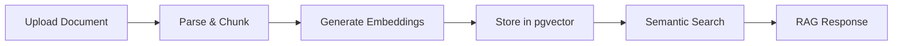

Knowledge Bases power RAG (Retrieval-Augmented Generation) for your agents. You can upload files, sync web pages, and search across all content semantically.

## Creating a Knowledge Base

1. Go to **Knowledge Bases** in the sidebar
2. Click **New Knowledge Base**
3. Enter a name and optional description
4. Select an embedding model (default: Amazon Titan)
5. Click **Create**

## Uploading Documents

1. Open a knowledge base and go to the **Documents** tab
2. Click **Upload**
3. Select files (PDF, Word, Excel supported)
4. Files are uploaded to S3, then a `document-ingestion` job is queued
5. The worker parses, chunks, embeds, and stores vectors in pgvector
6. Document status shows **PENDING** → **PROCESSING** → **READY**

## Adding Web Sources

1. Go to the **Sources** tab
2. Click **New Source**
3. Enter a URL and optional crawl settings:
   - **Crawl depth** — how many link hops to follow (default: 0)
   - **Max pages** — maximum pages to crawl (default: 10)
   - **Exclude patterns** — URL patterns to skip
4. Click **Save**
5. Click the **Sync** button to start crawling
6. The worker crawls pages, extracts text, uploads to S3, and enqueues ingestion

## Syncing Sources

- **Manual sync** — click the play icon on any source
- Sync status is shown on the source card
- Documents created from a source are linked and updated on re-sync

## Testing Search

1. Open a knowledge base and go to the **Test** tab
2. Enter a search query
3. Results show matching chunks with similarity scores
4. Toggle between **semantic** (vector) and **keyword** (tsvector) search

## Visualizing Embeddings

1. Go to the **Visualize** tab
2. The platform runs UMAP dimensionality reduction on embeddings
3. A 2D scatter plot shows document clusters
4. Hover to see the source document and chunk text

## Attaching to Agents

1. Edit an agent and go to **Settings**
2. Select a **Knowledge Base** from the dropdown
3. Save the agent
4. In the Playground, the agent will now use RAG to ground responses in your documents
