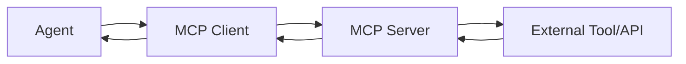

MCP (Model Context Protocol) is an open standard for connecting AI agents to external tools, data sources, and APIs.

## What is MCP?

MCP servers expose a set of tools that agents can invoke during inference. For example:
- A weather API that returns current conditions
- A database query tool
- A code execution sandbox
- A file system access tool

## Creating an MCP Server

1. Go to **MCP Servers** in the sidebar
2. Click **New MCP Server**
3. Enter:
   - **Name** — a display name
   - **Transport Type** — `stdio` or `sse`
   - **Command / Endpoint** — the executable path or HTTP endpoint
   - **Configuration** — JSON config object passed to the server
4. Click **Save**

## Testing Connection

1. Open an MCP server
2. Click **Test Connection**
3. The platform attempts to initialize the MCP client and list available tools
4. A green checkmark means the server is reachable and tools are discoverable

## Versioning

MCP server configurations support versioning:

1. In the MCP server editor, click **Save Version**
2. Enter a version note
3. Previous versions are listed and can be restored

## Attaching to Agents

1. Edit an agent and go to **Settings**
2. Select one or more **MCP Servers** from the dropdown
3. Save the agent
4. In the Playground, the agent can now invoke MCP tools during conversations

## Available Tools

When an MCP server is attached to an agent, the agent receives the tool schema at inference time. The LLM decides when to call a tool based on the conversation context. Tool results are streamed back to the user.
