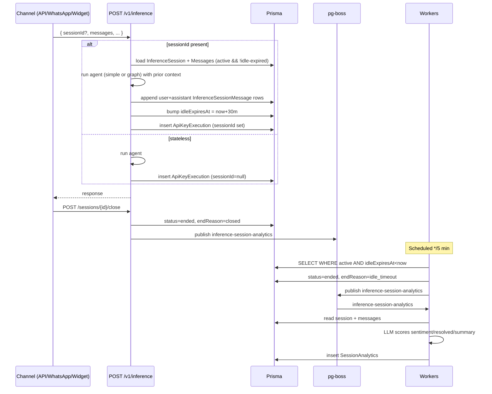

# Implementation Plan — Unified Inference Sessions Module

**Date:** 2026-05-20
**Status:** Approved for execution

## Problem Statement

Inferencing data is fragmented across four models (`Conversation`, `PlaygroundSession`, `InferenceSession`, `AgentExecution`/`ApiKeyExecution`) reached via three separate routes. The Sessions page under Analytics only reads `Conversation`, so API-driven inference work is invisible to operators. There is no concept of `channel`, so adding WhatsApp / Widget / SDK in the future would duplicate tables and code. The `Conversation`-based chat module has no use case. Conversation analytics runs on a job today, but it is wired to chat conversations, not API sessions, and there is no end-of-session signal that triggers it.

## Requirements (locked)

1. `InferenceSession` is the **only** table populated in the Sessions module.
2. **Only the Inference API** writes to it. Playground and the legacy chat module stay out.
3. Inference API supports stateful (`sessionId` present) and stateless (absent) calls in one endpoint.
4. Idle timeout: **30 min global default**, plus explicit close — both paths trigger end-of-session.
5. Session is identified by `sessionId` only; no `endUserId` field. `channelMetadata` (JSON) holds integrator-supplied user/channel identifiers.
6. `channel` starts with `"API"` only — string column, generic, easy to extend.
7. Session **end** emits an event → worker computes `SessionAnalytics` (sentiment, resolved, summary, etc.), re-purposed from existing `ConversationAnalytics`.
8. Both `simple` and `graph` agent runtimes must natively handle session load + append.
9. Drop `Conversation`, `Message`, `ConversationAnalytics`, `ConversationSummary`, `/chat` UI, and `/api/conversations`. Keep `PlaygroundSession` untouched.
10. Table name remains `InferenceSession`.

## Background / Findings from Code Review

- **Worker plumbing:** `apps/workers/src/index.ts` registers pg-boss handlers; `conversation-analytics` job already exists with full LLM-driven scoring (`apps/workers/src/jobs/conversation-analytics/handler.ts`). Repurpose in place. `pg-boss.schedule()` supports cron — used by web-crawl scheduler — so idle-watcher slots in cleanly.
- **Auth surface:** `validateInferenceApiKey` (in `apps/web-ui/app/api/v1/inference/lib/auth.ts`) already returns `{ tenantId, apiKeyId, agentId, quota }` — sufficient identity for every session write.
- **Inference route:** `POST /api/v1/inference/route.ts` already accepts `sessionId` and calls `InferenceSessionService.appendMessage` for the simple-agent path. The **graph-agent path silently ignores session state today** — latent bug to fix.
- **Per-call audit:** `ApiKeyExecution` already records latency, token usage, cache-hit, webhook delivery for every turn. Adding a nullable `sessionId` FK gives stateless and stateful runs a single audit table.
- **Existing `InferenceSession`:** `apiKeyId, tenantId, agentId, name, messages: Json, metadata: Json?, expiresAt`. Missing: `channel`, `channelMetadata` (rename from `metadata`), `agentVersionId`, `status`, `endedAt`, `endReason`. Messages-as-JSON blocks future vector search and granular per-message analytics.
- **Sessions UI today** (`/analytics/sessions`) is a clean filterable table; shape transfers directly. Detail page renders a Conversation-only schema; needs swap.

## Proposed Solution

### Schema (Prisma)

```
InferenceSession (extended)
  id, apiKeyId, tenantId, agentId, agentVersionId? (NEW),
  name?, channel (NEW, default "API"), channelMetadata Json? (NEW, replaces metadata),
  status (NEW, "active" | "ended"),
  startedAt, idleExpiresAt (RENAMED from expiresAt; bumped on each turn),
  endedAt? (NEW), endReason? (NEW: "closed" | "idle_timeout" | "error"),
  createdAt, updatedAt
  ──< messages InferenceSessionMessage[]   (NEW relation, replaces JSON blob)
  ──  analytics SessionAnalytics?           (NEW one-to-one)

InferenceSessionMessage (NEW)
  id, sessionId FK, role, content, tokenCount?,
  embedding vector(1024)? (future-proof for KB-style retrieval over session history),
  createdAt
  @@index([sessionId, createdAt])

SessionAnalytics (NEW; mirrors current ConversationAnalytics)
  sessionId @unique, tenantId, sentiment, sentimentScores Json,
  isResolved, confidenceScore, emotionalTone Json, summary,
  firstUserQuery, language, messageCount, analyzedAt

ApiKeyExecution (extended)
  + sessionId FK? (NEW, null for stateless calls)

DROPPED: Conversation, Message, ConversationAnalytics, ConversationSummary
KEPT untouched: PlaygroundSession (playground stays separate)
```

### Inference API behavior

- **Stateless** (no `sessionId`) → unchanged response flow; `ApiKeyExecution.sessionId = null`.
- **Stateful** (`sessionId` present) → load prior `InferenceSessionMessage` rows, run agent, append user + assistant turns as new rows, set `idleExpiresAt = now + 30min`, link `ApiKeyExecution.sessionId`. Stateful turns **bypass response cache** (each context is unique).
- **Both `simple` and `graph` paths** get the same session load/append wiring (closes the existing graph-path gap).

**New endpoint:** `POST /api/v1/inference/sessions/{id}/close` → marks `ended`, `endReason="closed"`, `endedAt=now`, publishes `inference-session-analytics` pg-boss job.

### Workers

- **`inference-session-analytics`** (repurposed `conversation-analytics`): reads session + normalized messages, calls LLM for scored JSON, writes `SessionAnalytics`. Skipped when fewer than 2 user messages exist.
- **`inference-session-idle-watcher`** (new, scheduled `*/5 * * * *`): finds `status='active' AND idleExpiresAt < now()`, flips them to `ended`/`idle_timeout`, enqueues analytics per session.

### UI

- New top-level `/sessions` (sidebar item replaces `Analytics > Sessions`).
- List columns: Session ID, Agent, Version, Channel, Status, Started, Last Activity, Messages, Sentiment, Resolved, Latency-avg.
- Filters: channel, status, sentiment, resolved, agent, date range.
- Detail page: header (id, channel, channelMetadata viewer), turn-by-turn message timeline, analytics card, linked `ApiKeyExecution` rows with token / latency / cache-hit per turn.

### Sequence diagram



## Task Breakdown

### Task 0: Write this plan to disk
Create `docs/superpowers/plans/2026-05-20-unified-inference-sessions.md` containing the entire plan. Create the directory if it does not exist.
**Demo:** the markdown file exists at the expected path with the full plan content.

### Task 1: Extend `InferenceSession` schema (additive only)
Add Prisma migration introducing `channel` (default `"API"`), `channelMetadata` (Json?, copy data from existing `metadata` then drop `metadata`), `agentVersionId` (FK nullable), `status` (default `"active"`), `endedAt`, `endReason`. Rename `expiresAt` → `idleExpiresAt`. Backfill: existing rows → `status='active'`, `channel='API'`. No data loss.
**Test:** unit test on a Prisma migration smoke (`prisma migrate dev` runs cleanly; existing inference API call still works against the new schema).
**Demo:** existing inference + sessions endpoints continue to work; `prisma studio` shows new columns populated with defaults.

### Task 2: Introduce `InferenceSessionMessage` normalized table + backfill
Add Prisma model with FK to `InferenceSession`, role/content/tokenCount/embedding/createdAt. Write a backfill migration script that reads each session's `messages` JSON array and inserts normalized rows preserving order. Drop the JSON `messages` column at the end. Update existing `findById` and message append code paths to read/write rows.
**Test:** backfill script unit test on fixture data; round-trip test (create session via API → append several messages → fetch → assert order/role/content).
**Demo:** `GET /v1/inference/sessions/{id}` returns the same message history as before, but rows now live in `InferenceSessionMessage`.

### Task 3: Rebuild `InferenceSessionService` for the new shape
Methods: `create({ apiKeyId, tenantId, agentId, agentVersionId?, name?, channel?, channelMetadata? })`, `findActiveById(id)` (active and `idleExpiresAt > now`), `appendMessage(id, message)` (writes a row + bumps `idleExpiresAt`), `endSession(id, reason)` (sets status/endedAt/endReason), `findStaleSessions({ idleBefore, limit })`. Remove the old TTL-based `cleanupExpired` semantics (idle-watcher replaces it).
**Test:** full unit-test suite for each method (mock Prisma); explicit assertion that `appendMessage` refreshes `idleExpiresAt`.
**Demo:** `bun test libs/shared` passes; service can be imported and called from a quick REPL script.

### Task 4: Update `POST /api/v1/inference` route for unified stateful/stateless flow
Wire (a) `idleExpiresAt` refresh on every stateful turn, (b) `ApiKeyExecution.sessionId` linkage, (c) cache bypass when `sessionId` present, (d) **graph-agent path also loads/appends session messages** (currently a no-op — closes a latent bug). Persist `agentVersionId` resolved at run time onto the session if not already set.
**Test:** integration test using msw or fetch-mock — three scenarios: stateless call (sessionId=null on execution), first stateful turn (session created, message rows = 2), follow-up stateful turn (idleExpiresAt bumped, message rows grow).
**Demo:** curl `/v1/inference` twice with the same `sessionId` → both turns appear in `InferenceSessionMessage`; third call after waiting → still works (idle not expired).

### Task 5: Add explicit `POST /api/v1/inference/sessions/{id}/close` endpoint
Validates the API key, marks the session `ended`/`closed`/`endedAt=now`, publishes the `inference-session-analytics` pg-boss job with `{ sessionId, tenantId }`. Returns 204. Idempotent: closing an already-ended session is a no-op success.
**Test:** integration — close on active session enqueues job exactly once; close on already-ended session does not double-enqueue.
**Demo:** curl close → DB row state changes; `pgboss.job` table shows the enqueued analytics job.

### Task 6: Update sessions CRUD endpoints (`GET/POST/GET[id]/DELETE[id]`) for new fields
`POST` accepts `name`, `channel` (default `"API"`), `channelMetadata`. `GET[id]` returns 410 only when `status='ended'` or `idleExpiresAt < now` (the latter is a transient state until the watcher promotes it). `DELETE` keeps semantics but ensures status transition + analytics-job enqueue if the session was still active.
**Test:** round-trip integration tests against a real Postgres test DB.
**Demo:** integrator-style flow — POST create with channelMetadata, send turns, GET shows messages + status, DELETE returns 204 and triggers analytics.

### Task 7: Add `SessionAnalytics` Prisma model + migration
Mirror current `ConversationAnalytics` columns (sentiment, sentimentScores Json, isResolved, confidenceScore, emotionalTone Json, summary, firstUserQuery, language, messageCount, analyzedAt) keyed by `sessionId @unique`. Index on `tenantId`, `tenantId+sentiment`, `tenantId+isResolved`.
**Test:** schema compiles; round-trip insert/read.
**Demo:** `prisma studio` shows the empty `SessionAnalytics` table.

### Task 8: Repurpose `conversation-analytics` worker → `inference-session-analytics`
Rename job + handler + register file. Read `InferenceSession + InferenceSessionMessage` instead of `Conversation + Message`. Skip when `userMessages < 2`. Re-use the existing LLM prompt verbatim — it's domain-agnostic. Write to `SessionAnalytics`. Update `apps/workers/src/index.ts` to register the renamed job.
**Test:** handler unit test feeding a session fixture, asserting the analytics row written matches the LLM JSON shape.
**Demo:** close a session → tail worker log → see "Analytics stored" → query `SessionAnalytics` row.

### Task 9: Add idle-watcher scheduled worker
New job `inference-session-idle-watcher`. Scheduled every 5 min via `boss.schedule('inference-session-idle-watcher', '*/5 * * * *', {})`. Handler queries `WHERE status='active' AND idleExpiresAt < now()` (paged, e.g. 100 at a time), updates each to `ended`/`idle_timeout`, enqueues an `inference-session-analytics` job per row. Runs in a single transaction per page so it's safe under concurrency.
**Test:** handler unit test with synthetic stale rows (idleExpiresAt = now-1h), asserting all flip to `ended` and N analytics jobs are published.
**Demo:** create a session, force-set its `idleExpiresAt` to past, wait one cron tick → row flips to `ended` automatically; analytics row appears shortly after.

### Task 10: Build `GET /api/sessions` aggregate endpoint + `/sessions` list page
Tenant-scoped via existing `getSessionTenantId`; permission `read` on `InferenceSession`. Returns sessions joined with `Agent`, `AgentVersion`, latest `SessionAnalytics`. Filters: `channel`, `status`, `sentiment`, `resolvedStatus`, `agentId`, date range, search (id/name). Page + size. UI mirrors the current `/analytics/sessions` table but with the new column set: Session ID · Agent (name + version) · Channel · Status · Started · Last Activity · Messages · Sentiment · Resolved · Avg Latency.
**Test:** API integration test (filter combinations); React component rendering test for empty / loading / populated states.
**Demo:** navigate to `/sessions` in the dashboard → see real inference sessions across the tenant with sentiment/resolved badges.

### Task 11: Build `/sessions/{id}` detail page + `GET /api/sessions/{id}`
Detail endpoint returns session header (id, agent, version, channel, channelMetadata, status, started/ended, endReason, idleExpiresAt), normalized message timeline, analytics card, and linked `ApiKeyExecution` rows (latency, tokens, cache-hit, webhook status per turn). UI: Header → Channel Metadata viewer (JSON pretty-print) → Messages timeline → Analytics card (sentiment, resolved, summary, language, scores) → Executions table.
**Test:** API integration test against a fixture session; component test for rendering all sections.
**Demo:** click any row from `/sessions` → see full session breakdown with per-turn metadata.

### Task 12: Wire navigation; remove `Chat` and `History` from sidebar
Update `components/layout/app-sidebar.tsx`: remove `Chat`, `History`, `Analytics > Sessions` entries. Add new top-level `Sessions` entry pointing to `/sessions`. Remove or 410 the corresponding routes (`/chat`, `/conversations`, `/analytics/sessions`).
**Test:** Playwright smoke — sidebar shows new item, clicking it lands on `/sessions`.
**Demo:** load dashboard → sidebar shows `Sessions` as a top-level item; old chat/history items are gone.

### Task 13: Drop chat-module schema + code
Migration: `DROP TABLE conversations, messages, conversation_analytics, conversation_summaries`. Remove Prisma models. Delete: `apps/web-ui/app/(dashboard)/chat`, `apps/web-ui/app/api/conversations`, `apps/web-ui/app/api/messages`, `apps/web-ui/app/(dashboard)/analytics/sessions`, `libs/shared/src/services/conversation-service.ts`, `message-service.ts`, conversation/message repositories, `apps/workers/src/jobs/conversation-summary` (delete to keep scope tight). Update `libs/shared/src/index.ts` exports.
**Test:** full `nx run-many --target=build` and `nx run-many --target=test` pass; tsc clean.
**Demo:** repo builds with no dead references; the only inferencing-data path in the system is the Inference API.

### Task 14: End-to-end verification + spec doc
Add a Playwright (or scripted curl) test that creates an API key, runs three stateful inference turns, closes the session, polls until `SessionAnalytics` is written, and asserts the row appears in `/sessions` with correct sentiment/resolved badges. Also a "stateless" path verifying `ApiKeyExecution.sessionId IS NULL`. The spec doc was already written in Task 0; in this task add a brief addendum to it (under a `## Verification` section) listing the e2e scenarios actually covered.
**Test:** e2e test green in CI.
**Demo:** run the e2e test locally → all assertions pass; `/sessions` page shows the freshly-analyzed session.

## Notes for the execution agent

- The user explicitly approved this plan. Proceed task-by-task in order.
- Strict scope: do not touch `PlaygroundSession` or the `/agents/playground` UI/API at any point.
- The chat module deletion (Task 13) is intentional — confirmed by the user; do not soft-archive `Conversation` data.
- Task 4 fixes a latent graph-agent bug (no session handling) — do this as part of unification, not as a separate change.
- Use existing patterns in the repo: pg-boss `register()` + `boss.work()` for handlers, `boss.schedule()` with cron for recurring jobs, `getSessionTenantId(authOptions)` for dashboard endpoints, `validateInferenceApiKey` for `/v1/*` endpoints.
- Default sidebar choice is **top-level `Sessions`** (replacing `Analytics > Sessions`).
- After each task, run the relevant `nx test` / `nx build` and verify the demo criterion before moving on.


---

## Verification (Task 14 addendum)

### Automated checks

| Check | Coverage | Where |
|---|---|---|
| `bunx prisma migrate deploy` | Applies all 5 new migrations: `extend_inference_session`, `inference_session_messages` (with JSON-blob backfill), `link_api_key_execution_to_session`, `session_analytics`, `drop_chat_module`. | DB |
| Shared lib unit tests | 11 cases covering `InferenceSessionService.create / findActiveById / findById / findByApiKeyId / appendMessage / endSession / findStaleSessions`, including idle-expiry refresh. | `libs/shared/src/services/inference-session-service.test.ts` |
| Idle-watcher unit tests | 3 cases covering: ends + enqueues per-row, no-op when concurrent watcher won the race, no work when queue empty. | `apps/workers/src/jobs/inference-session-idle-watcher/handler.test.ts` |
| Inference API auth | Playwright `inference-api.spec.ts` exercises `POST /v1/inference`, `POST/GET /v1/inference/sessions`, `POST /v1/inference/sessions/{id}/close`, `GET /v1/inference/sessions/{id}`, `DELETE /v1/inference/sessions/{id}` — all 401 unauthenticated paths. | `tests/e2e/inference-api.spec.ts` |
| Dashboard auth + nav | Playwright `navigation.spec.ts` validates `/sessions` is the canonical route, `/chat` has been removed, and the unauthenticated redirect to `/login` still works. | `tests/e2e/navigation.spec.ts` |
| Sessions dashboard auth | `GET /api/sessions` rejects unauthenticated with 401/403. | `tests/e2e/inference-api.spec.ts` |
| RBAC permissions test | 9 cases over the trimmed module set (Settings, Users, Tenants, Agents, KnowledgeBases, McpServers, LlmProviders) — Conversations/Messages dropped. | `libs/shared/src/rbac/permissions.test.ts` |
| Tenant middleware test | Asserts `TENANT_SCOPED_MODELS` no longer contains `Conversation` (5 models total). | `libs/shared/src/db/tenant-middleware.test.ts` |
| Authorize test | 9 cases use `Agent`/`InferenceSession` subjects (Conversations dropped). | `libs/shared/src/rbac/authorize.test.ts` |

### Manual verification recipe (requires Bedrock + a tenant API key)

```bash
# 1. Pre-reqs: dev server up, AWS Bedrock model access enabled, an API key issued for an active agent.
export KEY="your-tenant-api-key"
export BASE="http://localhost:3001"

# 2. Stateless turn — should record ApiKeyExecution with sessionId NULL.
curl -s -X POST "$BASE/api/v1/inference" \
  -H "Authorization: Bearer $KEY" \
  -H "Content-Type: application/json" \
  -d '{"messages":[{"role":"user","content":"hello"}],"stream":false}'

# 3. Open a session and run three stateful turns.
SESSION=$(curl -s -X POST "$BASE/api/v1/inference/sessions" \
  -H "Authorization: Bearer $KEY" -H "Content-Type: application/json" \
  -d '{"name":"e2e","channel":"API","channelMetadata":{"endUserId":"smoke-1"}}' \
  | jq -r '.id')

for q in "Hi, can you help me reset my password?" "I forgot my email too." "Thanks, that worked great."; do
  curl -s -X POST "$BASE/api/v1/inference" \
    -H "Authorization: Bearer $KEY" -H "Content-Type: application/json" \
    -d "{\"sessionId\":\"$SESSION\",\"messages\":[{\"role\":\"user\",\"content\":$q}],\"stream\":false}" \
    | jq -r '.content'
done

# 4. Close the session — enqueues inference-session-analytics.
curl -s -X POST "$BASE/api/v1/inference/sessions/$SESSION/close" \
  -H "Authorization: Bearer $KEY" -i | head -1

# 5. Wait a few seconds, then verify SessionAnalytics + dashboard view.
sleep 8
docker exec chatbot-postgres psql -U chatbot_admin -d chatbot \
  -c "SELECT \"sessionId\", sentiment, \"isResolved\", summary FROM session_analytics WHERE \"sessionId\" = '$SESSION';"

# 6. Open the dashboard at /sessions — the row should appear with sentiment + resolved badges.
```

### Idle-timeout path (manual)

```bash
# Force a session past idle: backdate its idleExpiresAt and wait for the cron to flip it.
docker exec chatbot-postgres psql -U chatbot_admin -d chatbot \
  -c "UPDATE inference_sessions SET \"idleExpiresAt\" = now() - interval '1 hour' WHERE id = '$SESSION';"
# Within ~5 minutes, the inference-session-idle-watcher cron will run; the row flips
# to status='ended', endReason='idle_timeout', and the analytics job fires automatically.
```
